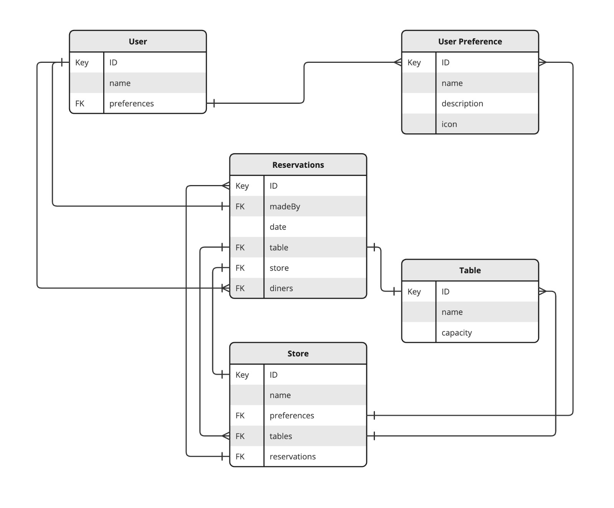

# Reservations API

## Technologies
This API runs a dokerized `express` application coded with `typescript` and uses `mongo` to store
all information and `mongoose` as db driver.

I used `faker` to generate random data, used to populate the database each time it starts.

## Quick start
To run the application you must have `docker` installed, simply run the dockerized version with `docker-compose up`.

you can run the application in local mode with `npm i` and then `npm start` but you need to have `mongo` service up and running so the app can connect and create documents on a database.

Dev mode runs with `npm run dev` but is recomended to comment the `seedDatabase` function after the first run to avoid re-seeding the app each time a change is made

## First Steps 
For documentation and testing you can use the `RAPI.postman_collection.json` file to load on Postman the most important endpoints and test them.
To create reservations you must query for `stores`, `users` (get preferences user store and table Ids to create)
Change the default values on the body and query parameters in the collection with your own autogenerated ones.

## Model Structure
The idea behind the structure was to be as flexible as posible.
I used `faker` to seed the application.

This is the entity relationship diagram:

